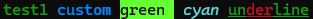
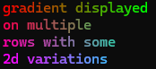
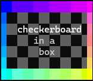

# node-styl-rgb
simple bash console rgb syling. like [node-styl](https://www.npmjs.com/package/node-styl)
 for 256 and 16m color terminals.

 Install :

 ```
 npm install node-styl-rgb
 ```


Add colors and styles to your logs :
```javascript
const { styl } = require('node-styl-rgb');
// or
import styl from 'node-styl-rgb';
...
console.log(""+styl('hello').front([80,255,0]).back([30,0,120]).underline);
```
[exemples](#exemples)


 Use preformated style with the property **theme** :
```javascript
...
const title = styl().front([80,255,0]).back([30,0,120]).underline.theme;
console.log("this is "+title(" A TITLE "));
console.log("this is "+title(" AN OTHER TITLE "));
```

 Clean rendered styles to handle text length :
 ```javascript
 ...
 const styled = "this is "+title(" A TITLE ");
 const text = styl.none(styled);
 console.log("styled=","'"+styled+"'",' length=',text.length);
 ```


styl will detect automaticly if your terminal handles true colors.
You can force rgb type by importing it instead of styl.
**available rgb displays are :**
* **types :**
	* c256 : 256 colors. ```require('node-styl-rgb').c256 ```
	* c16m : 16M colors. ```require('node-styl-rgb').c16m ```


**available properties are :**

* **theme :** theme renderer

* **text :** unstyled text content

* **styles :**
	* **bold** or **b**
	* **italic** or **i**
	* **underline** or **u**
	* **inverse**
	* **blink**
	* **strikethrough** or **s**

* **front colors :**
	* **white**
	* **grey**
	* **black**
	* **blue**
	* **cyan**
	* **green**
	* **magenta**
	* **red**
	* **yellow**

* **back colors :**
	* **whiteBG**
	* **greyBG**
	* **blackBG**
	* **blueBG**
	* **cyanBG**
	* **greenBG**
	* **magentaBG**
	* **redBG**
	* **yellowBG**

**available methods are :**
	
<!-- methods [ -->
* **methods :**
	 * [front](#method_front) : sets standard or rgb front color
	 * [back](#method_back) : sets standard or rgb back color
	 * [style](#method_style) : sets styles
	 * [string](#method_string) : Change contents
	 * [parse](#method_parse) : parse contents characters

#### <a name="method_front"></a> **front** : sets standard or rgb front color
```javascript
/**
Sets front color
@param input standard (ex:'red') or custom characters rgb color value
(ex:'#f00' or '#ff0000' or [255,0,0] or 0xff0000)
or number (red channel 0-255) if v2 & v3 are numbers.
@param v2 green channel 0-255
@param v3 blue channel 0-255
@returns styl
*/
front(input: RgbInputType | null, v2?: number, v3?: number): Styl
```
#### <a name="method_back"></a> **back** : sets standard or rgb back color
```javascript
/**
Sets background color
@param input standard (ex:'red') or custom background rgb color value
(ex:'#f00' or '#ff0000' or [255,0,0] or 0xff0000)
or number (red channel 0-255) if v2 & v3 are numbers.
@param v2 green channel 0-255
@param v3 blue channel 0-255
@returns styl
*/
back(input: RgbInputType | null, v2?: number, v3?: number): Styl
```
#### <a name="method_style"></a> **style** : sets styles
```javascript
/**
sets styles
@param value can be a style name like "bold" or a list of styles like "bold,i,u" or ["bold","i","u"]
@returns
*/
style(value: string | string[]): Styl
```
#### <a name="method_string"></a> **string** : Change contents
```javascript
/**
Sets a new content
@param text
*/
string(text: string): Styl
```
#### <a name="method_parse"></a> **parse** : parse contents characters
```javascript
/**
Parses string characters keeping trac of relatve position
@param callback
@returns
*/
parse(callback: (v: ParseCallbackDataType) => void): string
```

<!-- ] methods -->
## Exemples<a name="exemples"></a>

Use the command **styl.demo();** to render these exemples.

### Exemple 1
Base use exemple : simple title.
```javascript
console.log("-".repeat(10) + "|" + styl("node-styl demo").green.bold + "|" + "-".repeat(10));
```

### Exemple 2
Recursive styling.
```javascript
console.log('' 
	+ styl('test1 ' + styl('custom ').front('#08f')
	+ styl('green ').back([100, 255, 50]).black
	+ styl(' cyan ').cyan.italic.bold
	+ styl('un' + styl('der').red + 'line').u).green + ' ');
```



## Exemples with **parse**

### Exemple 3
Use **parse** to make simple linear gradient.
```javascript
console.log(
	styl('gradient ' + styl('underlined').u + ' text')
		.parse(obj => obj.styl
			.back([255 * obj.colP, 0, 0])
			.front([255, 255 * obj.colP, 255])
		)
	+ '');
```


### Exemple 4
Use **parse** to make 2d linear gradient.
```javascript
console.log(
	styl("gradient displayed\non multiple\nrows with some\n2d variations").parse(obj => {
		obj.styl.front([255 * (1 - obj.colP), 255 * obj.colP, 255 * obj.rowP]);
	}) + ""
);
```



### Exemple 4
Use **parse** to draw a box.
```javascript
console.log("* box :");
console.log(
	styl(
		[
			"+---------------+",
			"|               |",
			"|  " + styl(`checkerboard`).bold + " |",
			"|     in a      |",
			"|      box      |",
			"|               |",
			"+---------------+",
		].join("\n")
	).parse(obj => {
		if ("+-|".includes(obj.char)) {
			obj.styl.back([255 * obj.colP, 255 * obj.rowP, 255 * (1 - obj.colP * obj.rowP)]).hidden;
		} else if (Math.round(obj.col * 0.5 + obj.row) % 2) obj.styl.back("#444");
	}) + ""
);
```
